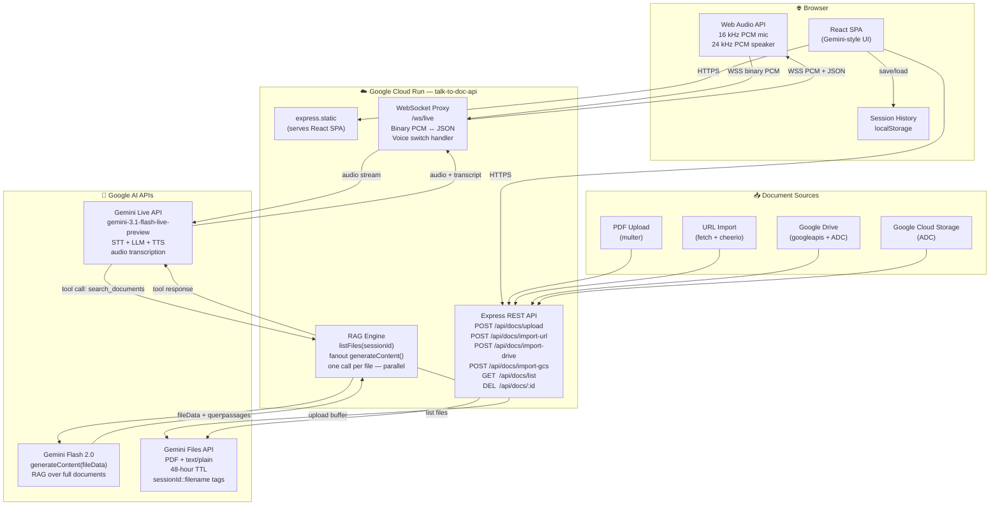
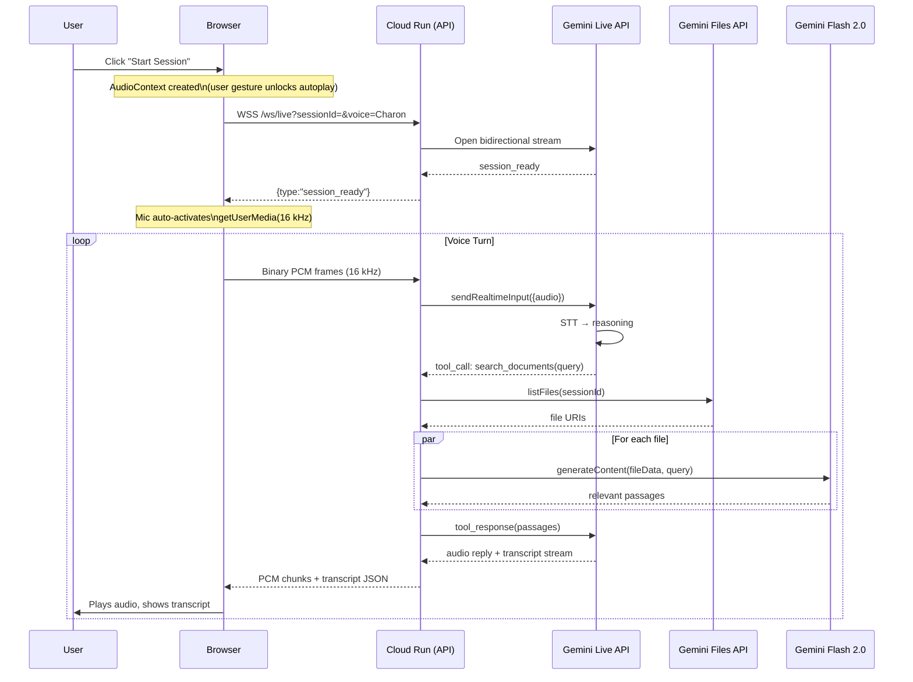

# Talk to Every Doc

> **Chat with your documents using voice or text — powered by Gemini Live AI.**

Upload PDFs, paste web URLs, connect Google Drive or Cloud Storage, then have a natural voice conversation about your files. No vector database, no embeddings — Gemini reads your documents directly.

🌐 **Live:** https://talk-to-doc-api-1085727639300.us-central1.run.app

---

## Features

- 🎙 **Voice conversation** — Gemini Live handles STT + LLM + TTS in one real-time stream
- 📄 **PDF upload** — drag-and-drop directly in the browser
- 🔗 **URL import** — paste any public web page to scrape and index its text
- 📂 **Google Drive import** — share a file with the service account, paste the link
- 🪣 **GCS import** — import from any `gs://bucket/path` your service account can read
- 🔍 **RAG search** — Gemini searches your documents mid-conversation via function calling
- 🕓 **Session history** — conversations auto-saved to localStorage, browsable and restorable
- 🔄 **Voice switching** — change voice gender/name mid-session by asking the AI

---

## High-Level Architecture



---

## Voice Conversation Flow



---

## Document Import Flow

```mermaid
flowchart LR
    A1["📄 PDF Upload\ndrag-and-drop"] -->|multer buffer| Store
    A2["🔗 URL Import\npaste link"] -->|fetch + cheerio\nHTML → text/plain| Store
    A3["📂 Google Drive\npaste share URL"] -->|googleapis + ADC\ndownload bytes| Store
    A4["🪣 GCS Import\ngs://bucket/path"] -->|@google-cloud/storage\n+ ADC| Store

    Store["Gemini Files API\n📁 sessionId::filename\n⏱ 48-hr auto-expire"]

    Store -->|fileData URI| RAG["RAG Engine\ngenerateContent()\nper file in parallel"]
    RAG -->|ranked passages| Answer["💬 Gemini Live\nAnswer to user"]
```

---

## Project Structure

```
talk-to-every-doc/
├── apps/
│   ├── api/                    # Node.js 20 + TypeScript + Express
│   │   └── src/
│   │       ├── index.ts        # Server entry: Express + WS + static serving
│   │       ├── live/
│   │       │   └── session.ts  # Gemini Live proxy, function calling, voice switch
│   │       ├── rag/
│   │       │   ├── file-store.ts   # Gemini Files API CRUD
│   │       │   └── retrieval.ts    # Parallel RAG search via generateContent
│   │       └── routes/
│   │           └── docs.ts     # upload / import-url / import-drive / import-gcs
│   └── web/                    # React 18 + Vite + TailwindCSS
│       └── src/
│           ├── App.tsx         # Layout: sidebar + chat + history
│           ├── components/
│           │   ├── ChatArea.tsx        # Gemini-style chat UI
│           │   └── DocumentSidebar.tsx # Docs tab + History tab
│           ├── hooks/
│           │   ├── useGeminiLive.ts    # WebSocket + Web Audio + mic
│           │   └── useSessionHistory.ts # localStorage persistence
│           └── types/index.ts
├── apps/api/Dockerfile         # Multi-stage: builds React SPA + API together
├── cloudbuild.yaml             # Cloud Build → Artifact Registry
└── architecture.html           # Interactive architecture diagram
```

---

## Quick Start (Local Development)

### Prerequisites

- Node.js 20+
- pnpm 9+
- A [Google AI API key](https://aistudio.google.com/app/apikey)

### 1. Install dependencies

```bash
pnpm install
```

### 2. Configure environment

```bash
# apps/api/.env
GOOGLE_AI_API_KEY=your_key_here
PORT=3001
```

### 3. Run

```bash
# Terminal 1 — API
cd apps/api; pnpm dev

# Terminal 2 — Web
cd apps/web; pnpm dev
```

- API: http://localhost:3001
- Web: http://localhost:5173

---

## Deployment (Google Cloud Run)

The frontend and API are served from a **single Cloud Run container** — no separate Vercel deployment needed.

```bash
# Build and push Docker image
gcloud builds submit --config cloudbuild.yaml --project YOUR_PROJECT

# Deploy
gcloud run deploy talk-to-doc-api \
  --image us-central1-docker.pkg.dev/YOUR_PROJECT/aegis-containers/talk-to-doc-api:latest \
  --region us-central1 \
  --allow-unauthenticated \
  --set-env-vars "GOOGLE_AI_API_KEY=...,CORS_ORIGINS=*,NODE_ENV=production"
```

The multi-stage Dockerfile:
1. Builds the React SPA (`apps/web/dist`)
2. Compiles TypeScript API (`apps/api/dist`)
3. Copies both into the runtime image
4. Express serves the SPA via `express.static` + SPA fallback

---

## Tech Stack

| Layer | Technology |
|---|---|
| Frontend | React 18, Vite, TailwindCSS (Google/Gemini design) |
| Backend | Node.js 20, TypeScript, Express, `ws` |
| Voice AI | Gemini Live API (`gemini-3.1-flash-live-preview`) |
| Document AI | Gemini Flash 2.0 (`generateContent` with `fileData`) |
| File Storage | Gemini Files API (48-hr temp storage) |
| Document Import | multer, cheerio, googleapis, @google-cloud/storage |
| Deployment | Google Cloud Run, Cloud Build, Artifact Registry |
| Session History | Browser localStorage (up to 50 sessions) |

---

## Roadmap

- [ ] Multi-user sessions with persistent document libraries
- [ ] Support for DOCX, XLSX, images (Gemini multi-modal)
- [ ] Shareable session links
- [ ] Custom AI personas / system prompts per workspace
- [ ] Webhook export — push summaries to Slack, Notion, email
